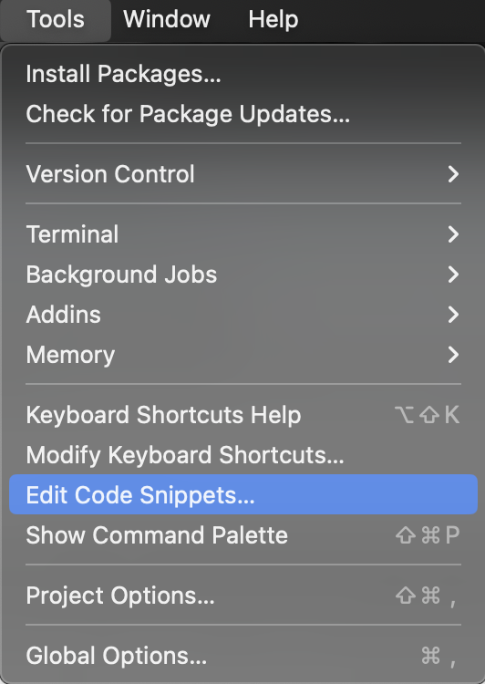
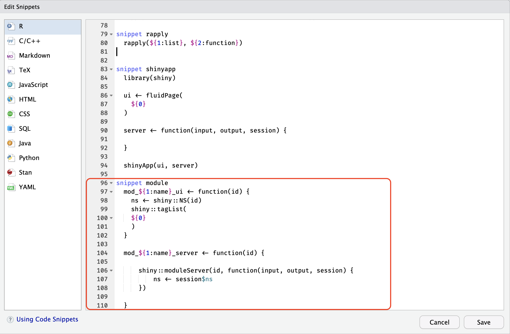
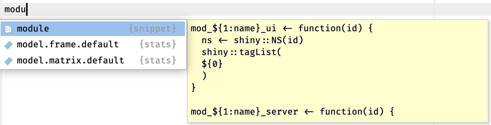
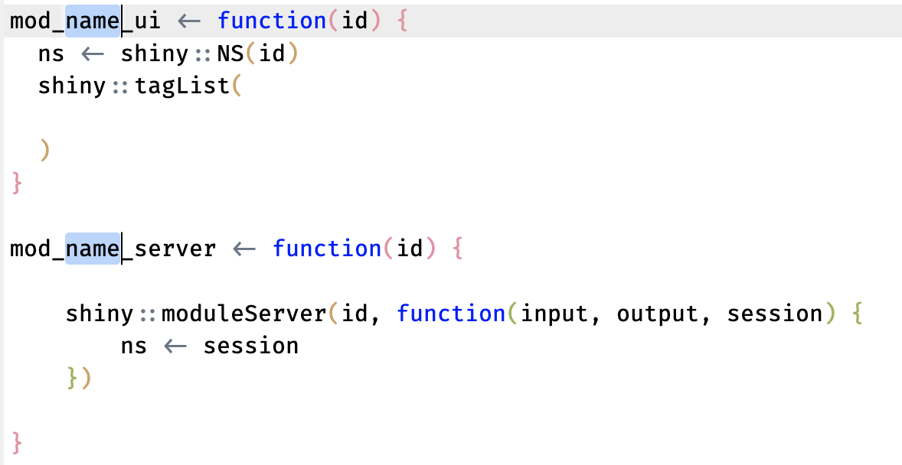
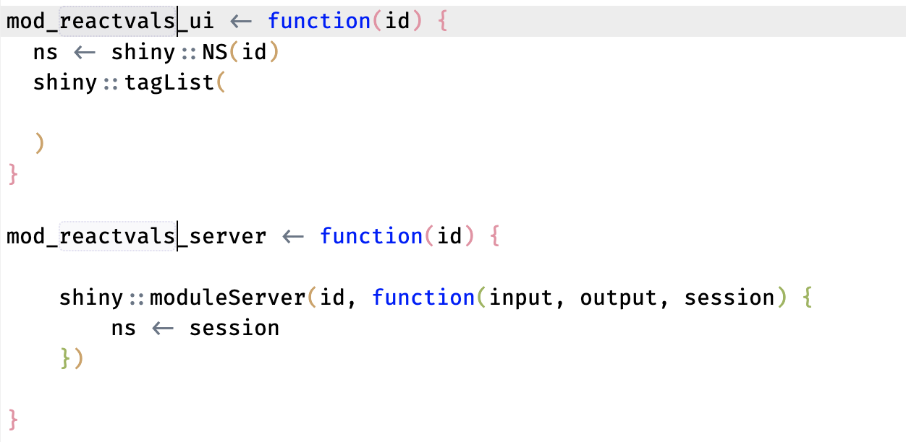

```{r, include = FALSE}
knitr::opts_chunk$set(
  collapse = TRUE,
  comment = "#>",
  eval = FALSE
)
```

```{r setup, eval=TRUE}
library(shinymods)
```

# Purpose 

The purpose of this vignette is to demonstrate how `NS()` and `moduleServer()` create isolated namespaces for the IDs in a module. To do this, I'll create a basic module: `reactvals`

The packages I'll use are loaded below: 

```{r pkgs, eval=TRUE}
library(testthat)
library(fs)
library(glue)
library(cli)
library(shiny)
```

## Creating modules (with a snippet)

The fastest way to add a module is using [Posit's code snippets](https://support.posit.co/hc/en-us/articles/204463668-Code-Snippets), which I can access using **Tools** > **Edit Code Snippets** : 

```{r snippet, echo=FALSE, eval=TRUE, out.width='40%', fig.align='center'}

```

This will open the **Edit Snippets** window where I can add or edit the existing code snippets. I'll place the new `module` snippet at the end/bottom:

```{r edit-snippet, echo=FALSE, eval=TRUE, out.width='80%', fig.align='center'}

```

The code to create a module with a snippet is below:

-   Note that I'm using a `mod_` prefix on both functions, and the `_ui` and `_server` suffix

    ```{r code-snippet, eval=FALSE}
    snippet module
    	mod_${1:name}_ui <- function(id) {
    	  ns <- shiny::NS(id)
    	  shiny::tagList(
    		${0}
    	  )
    	}
    	
    	mod_${1:name}_server <- function(id) {
    	
    			shiny::moduleServer(id, function(input, output, session) {
    					ns <- session$ns
    			})
    	  
    	}
    ```

After entering the snippet code, I click **Save**. To create a new module, I create the .R file using the drop-down or `usethis::use_r()`, then start typing `module`:

```{r module-snippet, echo=FALSE, eval=TRUE, out.width='90%', fig.align='center'}

```

-   This module naming convention is my preference, but it's a good practice to make sure you can easily identify the UI and server module function pairs (and being able to use the tab-completion is always nice, too)

I can hit tab and **BAM**--new code for my module:

```{r name-module-code, eval=FALSE}
mod_name_ui <- function(id) {
  ns <- shiny::NS(id)
  shiny::tagList(
  
  )
}

mod_name_server <- function(id) {

    shiny::moduleServer(id, function(input, output, session) {
        ns <- session
    })
  
}
```

My cursor is set on the `<name>` for *both* the UI and server module functions, so I can just type the new name of my new module:

```{r module-name, echo=FALSE, eval=TRUE, out.width='90%', fig.align='center'}

```

And it changes in both places:

```{r module-named, echo=FALSE, eval=TRUE, out.width='90%', fig.align='center'}

```

*This is also covered in [Mastering Shiny.](https://mastering-shiny.org/scaling-modules.html?q=snippet#exercises-18)* 

## Creating modules (with `shinymods`)

```{r mod_p_reactvals-output}
# put in UI ----
  mod_reactvals_ui <- function(id) {
  ns <- shiny::NS(id)
  shiny::tagList(
    shiny::fluidRow(
      shiny::column(
        width = 12,
        shiny::verbatimTextOutput(
          outputId = ns('vals')
        )
      )
    )
  )
}

# put in server ----
      mod_reactvals_server <- function(id) {
        shiny::moduleServer(id, function(input, output, session) {
          ns <- session$ns
          output$vals <- shiny::renderPrint({
            vals <- shiny::reactiveValuesToList(
              x = input, all.names = TRUE
            )
            print(vals)
          })
        })
    }
```


## Module structure 

```{r reactvals, eval=FALSE}
mod_reactvals_ui <- function(id) {
  ns <- shiny::NS(id)
  shiny::tagList(
  
  )
}

mod_reactvals_server <- function(id) {

    shiny::moduleServer(id, function(input, output, session) {
        ns <- session
    })
  
}
```


```{r dev, eval=FALSE, echo=FALSE}
dev_ui <- function(id) {
  ns <- shiny::NS(id)
  shiny::tagList(
    shiny::fluidRow(
      shiny::column(
        width = 12,
        shiny::verbatimTextOutput(
          outputId = ns("dev")
        )
      )
    )
  )
}

dev_server <- function(id) {
  shiny::moduleServer(id, function(input, output, session) {
    ns <- session$ns
    output$dev <- shiny::renderPrint({
      vals <- shiny::reactiveValuesToList(
        x = input, all.names = TRUE
      )
      print(vals)
    })
  })
}

shiny::shinyApp(
  # put in UI ----
  ui = dev_ui("x"),
  # put in server ----
  server = function(input, output, session) {
    dev_server("x")
  }
)

```

The app below is identical to the app in [Getting Started with {shinytest2} Part I | Example + basics | RStudio](https://www.youtube.com/watch?v=Gucwz865aqQ).

```{r}
library(shiny)
library(stringr)

ui <- shiny::fluidPage(
  shiny::textInput("name", "what is your name"),
  shiny::actionButton("greet", "Greet"),
  shiny::textOutput("greeting"),
  shiny::textOutput("first_letter")
)

server <- function(input, output, session) {

  output$greeting <- shiny::renderText({
    shiny::req(input$name)
    paste0("Hello ", input$name, "!")
  }) |>
    bindEvent({input$greet})

  first_letter <- shiny::reactive({
    shiny::req(input$name)
    stringr::str_to_lower(
      stringr::str_extract(input$name, "^."))
  }) |>
    shiny::bindEvent({input$greet})

  output$first_letter <- shiny::renderText({
    paste0("The first letter in your is ",
          first_letter(), "!")
  })

}

shiny::shinyApp(ui, server)
```

